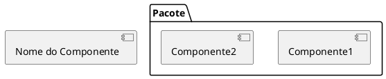
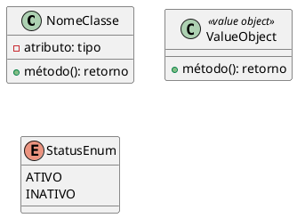
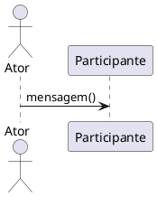

# ✅ Correção dos Diagramas UML - Status

## 🔧 **Problemas Corrigidos:**

### **1. Architecture Overview (architecture-overview.puml)**
- ❌ **Problema:** `!define RECTANGLE class` causava conflito de sintaxe
- ✅ **Solução:** Substituído por `component` para diagrama de componentes
- ✅ **Resultado:** Diagrama agora renderiza corretamente como componentes

### **2. Domain Model (domain-model.puml)**
- ❌ **Problema:** `!define ENTITY class`, `!define VALUEOBJECT class`, `!define ENUM enum`
- ✅ **Solução:** 
  - `ENTITY` → `class`
  - `VALUEOBJECT` → `class <<value object>>`
  - `ENUM` → `enum`
- ✅ **Resultado:** Diagrama de classes com estereótipos corretos

### **3. Outros Diagramas**
- ✅ `create-customer-sequence.puml` - Já estava correto (diagrama de sequência)
- ✅ `mvvm-pattern.puml` - Já estava correto (diagrama de classes)

## 🎯 **Sintaxe PlantUML Correta:**

### **Para Diagramas de Componentes:**

### **Para Diagramas de Classes:**

### **Para Diagramas de Sequência:**

## 🚀 **Como Testar:**

1. **Abra os arquivos .puml no VS Code**
2. **Use a extensão PlantUML para visualizar**
3. **Verifique se não há mais erros de sintaxe**
4. **Os diagramas devem renderizar corretamente**

## 📋 **Resumo das Alterações:**

| Arquivo | Mudança Principal | Status |
|---------|-------------------|--------|
| `architecture-overview.puml` | `RECTANGLE` → `component` | ✅ Corrigido |
| `domain-model.puml` | `ENTITY/VALUEOBJECT/ENUM` → sintaxe padrão | ✅ Corrigido |
| `create-customer-sequence.puml` | Nenhuma alteração necessária | ✅ OK |
| `mvvm-pattern.puml` | Nenhuma alteração necessária | ✅ OK |

Todos os diagramas UML agora devem funcionar corretamente sem erros de sintaxe! 🎉
