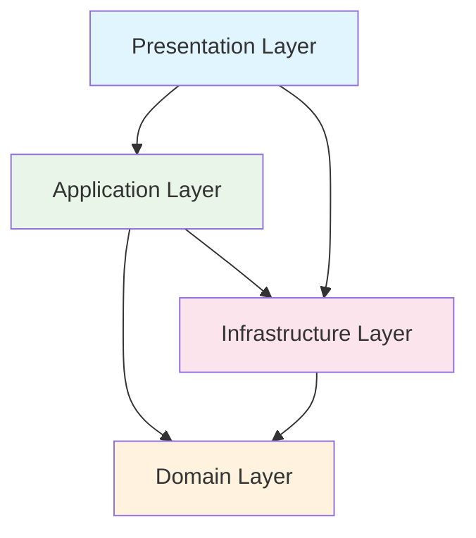

# 2. Arquitetura de Camadas

## Estrutura de Camadas

A aplicação está organizada em quatro camadas principais, seguindo os princípios do DDD e Clean Architecture:

### 2.1 Presentation Layer (UI)

**Responsabilidades:**
- Interface do usuário (Views)
- ViewModels (MVVM)
- Binding de dados
- Navegação entre telas
- Validação de entrada do usuário

**Componentes:**
```
📁 Presentation/
├── 📁 Views/
│   ├── MainWindow.xaml
│   ├── CustomerListView.xaml
│   └── CustomerDetailView.xaml
├── 📁 ViewModels/
│   ├── MainViewModel.cs
│   ├── CustomerListViewModel.cs
│   └── CustomerDetailViewModel.cs
├── 📁 Converters/
│   └── BoolToVisibilityConverter.cs
├── 📁 Controls/
│   └── CustomButton.xaml
└── 📁 Behaviors/
    └── ValidationBehavior.cs
```

### 2.2 Application Layer

**Responsabilidades:**
- Orquestração de chamadas para APIs
- Coordenação entre serviços
- Mapeamento de DTOs
- Validação de entrada
- Cache de dados
- Tratamento de erros
- Logging de operações

**Componentes:**
```
📁 Application/
├── 📁 Services/
│   ├── ICustomerService.cs
│   └── CustomerService.cs
├── 📁 DTOs/
│   ├── CustomerDto.cs
│   ├── CreateCustomerDto.cs
│   └── PagedResult.cs
├── 📁 Validators/
│   └── CreateCustomerValidator.cs
├── 📁 Mappers/
│   └── CustomerMapper.cs
└── 📁 Interfaces/
    ├── IApplicationService.cs
    └── IApiService.cs
```

### 2.3 Domain Layer

**Responsabilidades:**
- Entidades do domínio (modelos locais)
- Value Objects
- Regras de negócio locais
- Domain Services para lógica complexa
- Validações de domínio

**Componentes:**
```
📁 Domain/
├── 📁 Entities/
│   ├── Customer.cs
│   ├── Order.cs
│   └── Product.cs
├── 📁 ValueObjects/
│   ├── Email.cs
│   ├── Money.cs
│   └── Address.cs
├── 📁 Services/
│   └── ValidationService.cs
├── 📁 Events/
│   └── CustomerSelectedEvent.cs
└── 📁 Exceptions/
    └── DomainException.cs
```

**Nota:** Na arquitetura de microserviços, a lógica de domínio principal está nos microserviços. O Domain Layer no cliente MAUI contém apenas modelos e validações locais necessárias para a experiência do usuário.

### 2.4 Infrastructure Layer

**Responsabilidades:**
- Implementação de API services
- Comunicação HTTP com microserviços
- Autenticação e autorização
- Cache local
- Logging

**Componentes:**
```
📁 Infrastructure/
├── 📁 Api/
│   ├── CustomerApiService.cs
│   ├── OrderApiService.cs
│   └── AuthenticationService.cs
├── 📁 Http/
│   ├── HttpClientExtensions.cs
│   ├── RetryPolicies.cs
│   └── AuthenticationHandler.cs
├── 📁 Cache/
│   ├── ICacheService.cs
│   └── MemoryCacheService.cs
├── 📁 Logging/
│   └── SerilogConfiguration.cs
└── 📁 Configuration/
    └── DependencyInjection.cs
```

## Dependências entre Camadas



## Regras de Dependência

1. **Domain Layer**: Não depende de nenhuma outra camada
2. **Application Layer**: Depende apenas do Domain Layer
3. **Infrastructure Layer**: Pode depender de Domain e Application
4. **Presentation Layer**: Pode depender de todas as outras camadas

## Padrões Aplicados

### API Gateway Pattern
- Ponto único de entrada para múltiplos microserviços
- Agregação de dados de diferentes serviços
- Centralização de autenticação e autorização

### HTTP Client Pattern
- Abstração da comunicação HTTP
- Facilita testes unitários
- Permite configuração de timeout e retry

### Cache-Aside Pattern
- Cache local para reduzir chamadas à API
- Melhora performance e offline experience
- Invalidação inteligente de cache

### Dependency Injection
- Inversão de controle
- Facilita testes
- Melhora flexibilidade

### API Integration Pattern
- Comunicação com microserviços via HTTP APIs
- Centralização da lógica de negócio nos microserviços
- Cliente Desktop focado em apresentação e UX

## Exemplo de Fluxo

```csharp
// 1. User clicks button in View
// 2. Command in ViewModel is executed
public class CustomerListViewModel : ObservableObject
{
    private readonly ICustomerService _customerService;
    
    [RelayCommand]
    private async Task LoadCustomers()
    {
        // 3. Calls Application Service
        var customers = await _customerService.GetAllCustomersAsync();
        
        // 4. Updates observable collection
        Customers.Clear();
        foreach (var customer in customers)
        {
            Customers.Add(customer);
        }
    }
}

// 3. Application Service orchestrates API calls
public class CustomerService : ICustomerService
{
    private readonly ICustomerApiService _apiService;
    
    public async Task<IEnumerable<CustomerDto>> GetAllCustomersAsync()
    {
        // 4. Calls API Service (Infrastructure Layer)
        var result = await _apiService.GetCustomersAsync(page: 1, size: 50);
        
        // 5. Returns DTOs from API
        return result.Items;
    }
}

// 4. Repository accesses data
public class CustomerRepository : ICustomerRepository
{
    private readonly ApplicationDbContext _context;
    
    public async Task<IEnumerable<Customer>> GetAllAsync()
    {
        return await _context.Customers.ToListAsync();
    }
}
```

## Próximos Tópicos

- [Padrão MVVM](./03-padrao-mvvm.md)
- [Domain-Driven Design](./04-domain-driven-design.md)
- [Design System](./05-design-system.md)
