# 8. Diagramas UML

## Introdução aos Diagramas UML

Este documento apresenta os diagramas UML que ilustram a arquitetura e design da aplicação MAUI Desktop com MVVM e DDD. Os diagramas são criados usando PlantUML, Mermaid e Draw.io.

## Diagrama de Arquitetura Geral

### 8.1 Visão Geral da Arquitetura

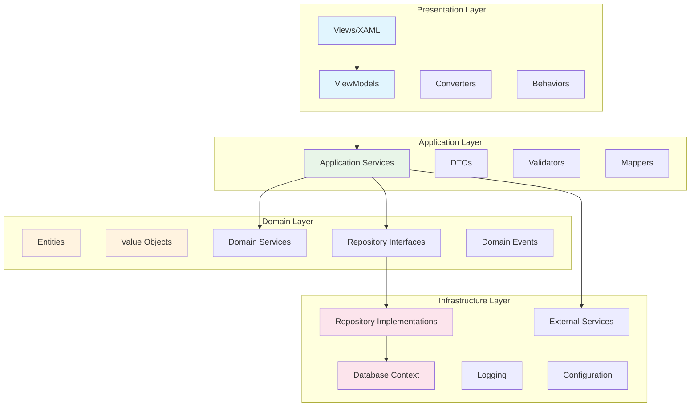

### 8.2 Diagrama de Camadas (PlantUML)

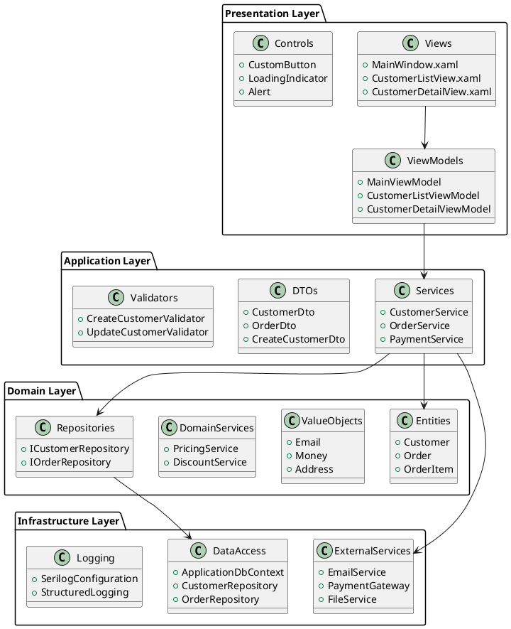

## Diagramas de Classes

### 8.3 Domain Model - Customer Aggregate

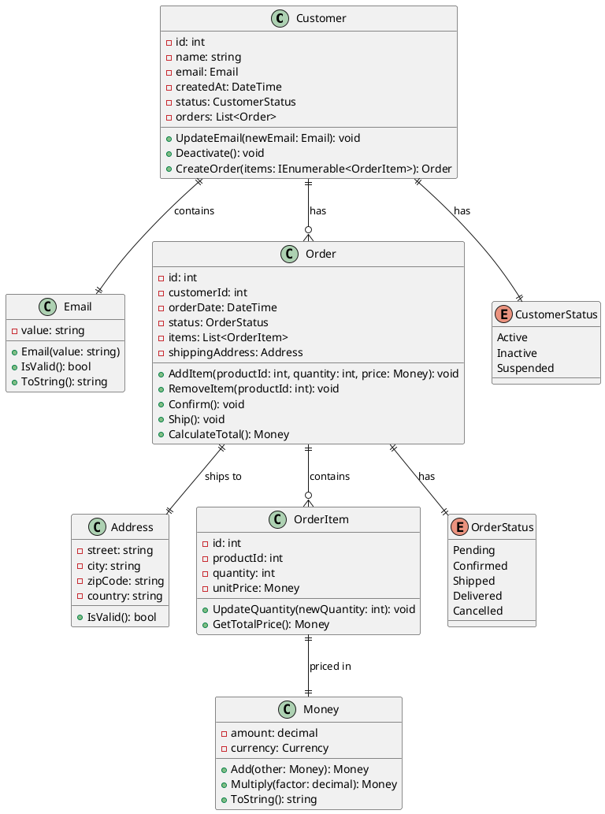

### 8.4 MVVM Pattern

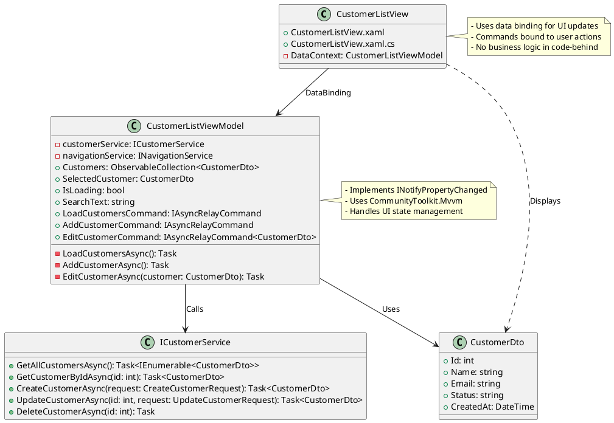

### 8.5 Repository Pattern

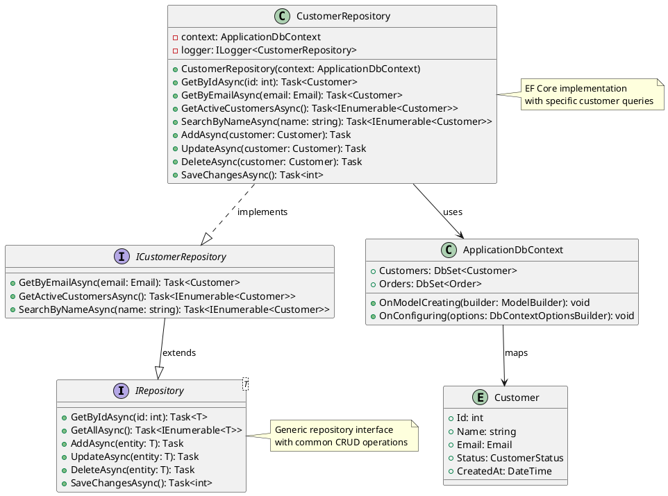

## Diagramas de Sequência

### 8.6 Create Customer Use Case

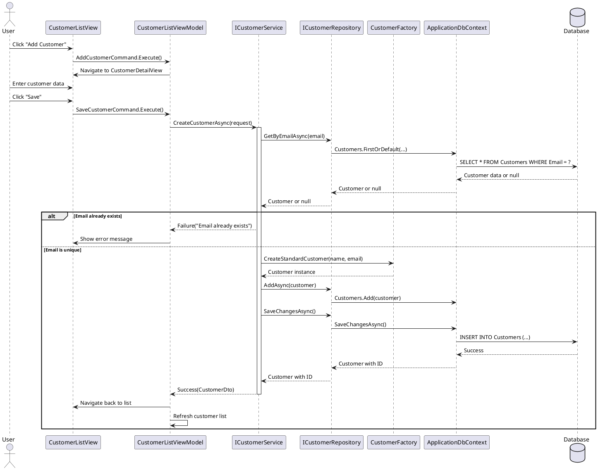

### 8.7 Order Processing Sequence

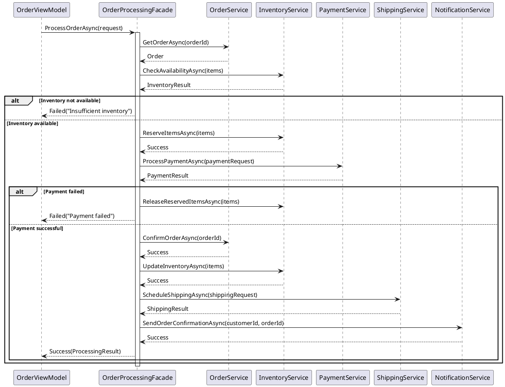

## Diagramas de Atividade

### 8.8 Customer Registration Flow

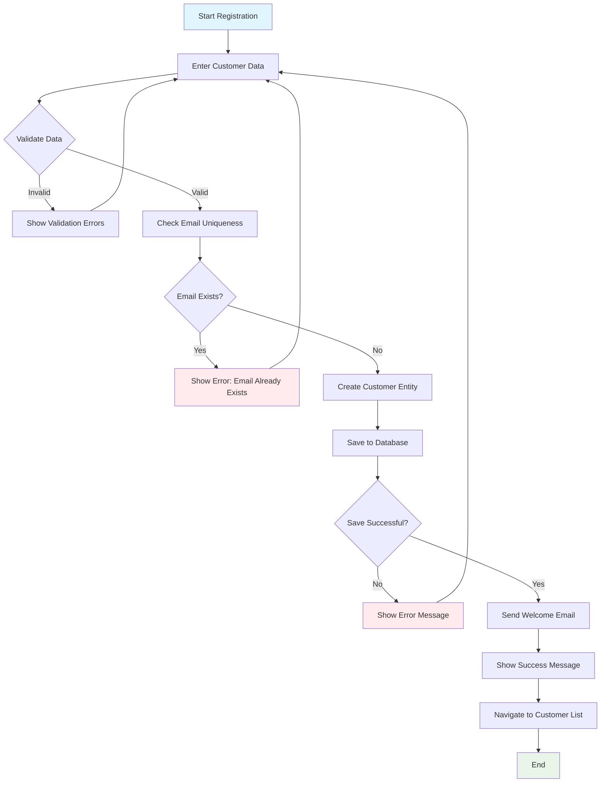

### 8.9 Order Processing Workflow

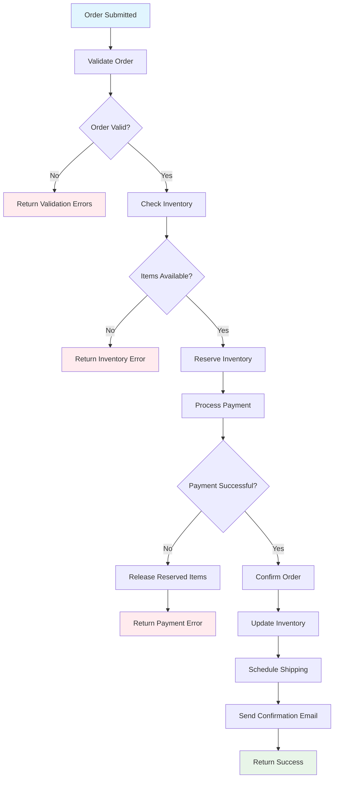

## Diagramas de Componentes

### 8.10 Application Components

```plantuml
@startuml Application_Components
!define COMPONENT component

package "MAUI Application" {
    COMPONENT [Presentation Layer] as PL {
        [Views]
        [ViewModels] 
        [Converters]
        [Behaviors]
    }
    
    COMPONENT [Application Layer] as AL {
        [Application Services]
        [DTOs]
        [Validators]
        [Mappers]
    }
    
    COMPONENT [Domain Layer] as DL {
        [Entities]
        [Value Objects]
        [Domain Services]
        [Repository Interfaces]
        [Domain Events]
    }
    
    COMPONENT [Infrastructure Layer] as IL {
        [Data Access]
        [External Services]
        [Logging]
        [Configuration]
    }
}

COMPONENT [Database] as DB
COMPONENT [External APIs] as API
COMPONENT [File System] as FS
COMPONENT [Email Service] as EMAIL

PL --> AL : Uses
AL --> DL : Uses
AL --> IL : Uses
IL --> DL : Implements
IL --> DB : Connects
IL --> API : Calls
IL --> FS : Reads/Writes
IL --> EMAIL : Sends

note right of PL
    - XAML Views
    - ViewModels with MVVM
    - Data Binding
    - Commands
end note

note right of AL
    - Use Cases
    - Application Services
    - Data Transfer Objects
    - Validation
end note

note right of DL
    - Business Logic
    - Domain Rules
    - Aggregates
    - Domain Events
end note

note right of IL
    - Data Persistence
    - External Integrations
    - Cross-cutting Concerns
end note

@enduml
```

### 8.11 MVVM Component Interaction

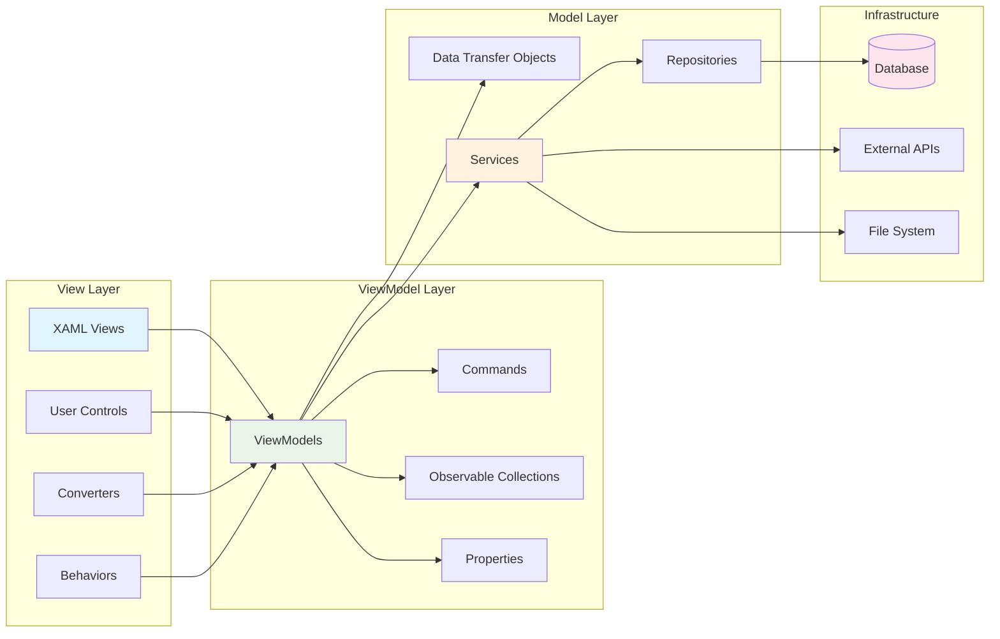

## Diagramas de Estado

### 8.12 Order State Machine

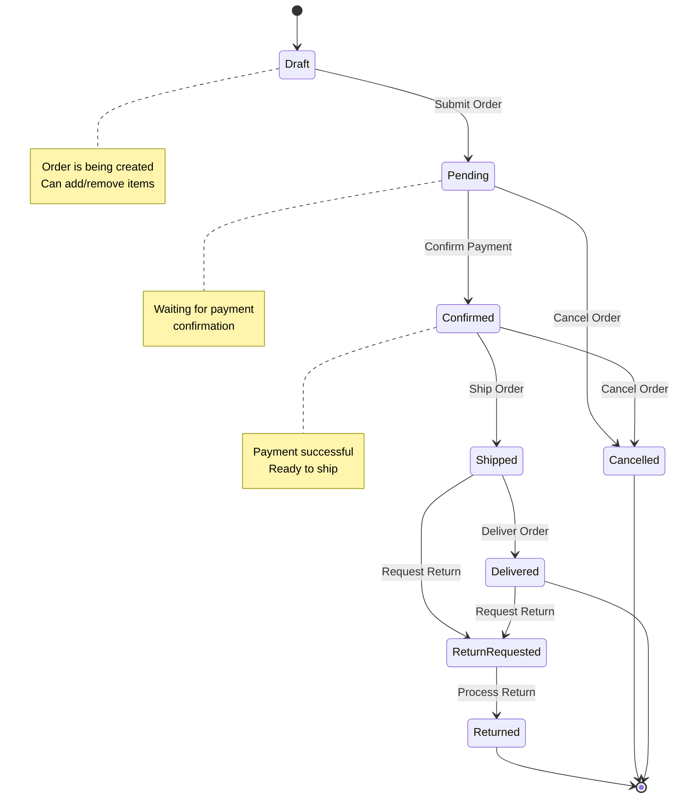

### 8.13 Customer State Machine

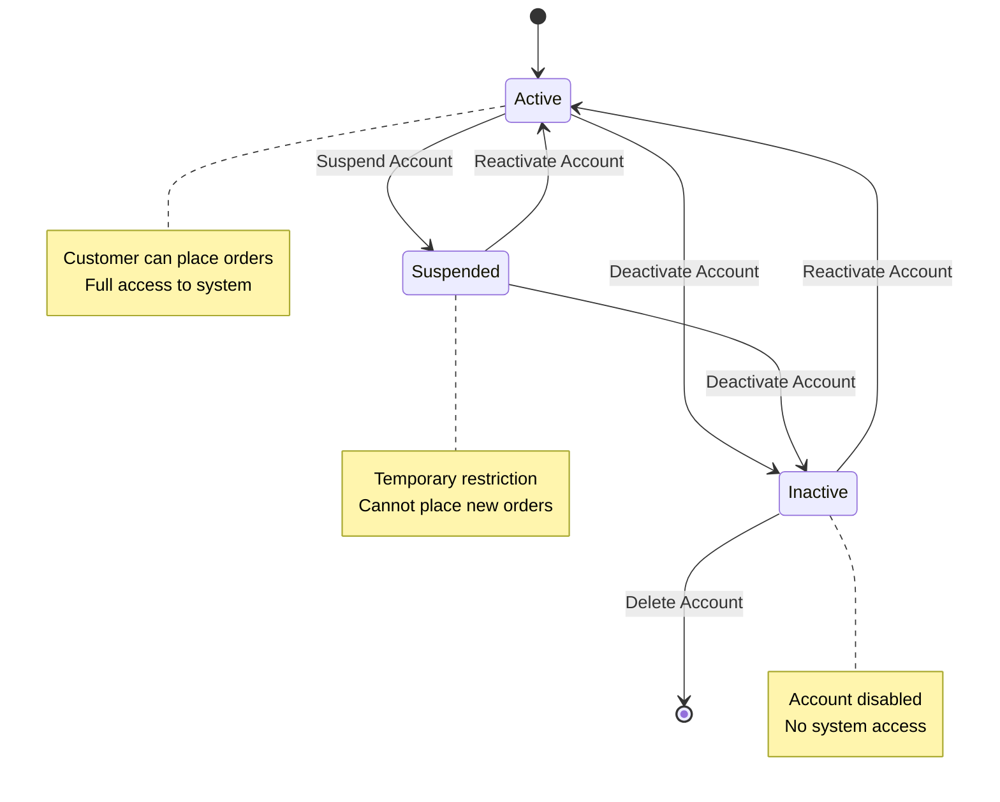

## Como Usar os Diagramas

### 8.14 Ferramentas Recomendadas

1. **PlantUML**: Para diagramas de classes, sequência e componentes
2. **Mermaid**: Para fluxogramas e diagramas de estado
3. **Draw.io**: Para diagramas personalizados e wireframes
4. **VS Code Extensions**: PlantUML, Mermaid Preview, Draw.io Integration

### 8.15 Geração Automática

```csharp
// Infrastructure/Documentation/DiagramGenerator.cs
public class DiagramGenerator
{
    public async Task GenerateClassDiagramAsync(Assembly assembly, string outputPath)
    {
        var types = assembly.GetTypes()
            .Where(t => t.Namespace?.Contains("Domain") == true)
            .ToList();

        var plantUml = new StringBuilder();
        plantUml.AppendLine("@startuml");
        
        foreach (var type in types)
        {
            if (type.IsClass)
            {
                plantUml.AppendLine($"class {type.Name} {{");
                
                // Add properties
                foreach (var prop in type.GetProperties())
                {
                    plantUml.AppendLine($"  + {prop.Name}: {prop.PropertyType.Name}");
                }
                
                // Add methods
                foreach (var method in type.GetMethods(BindingFlags.Public | BindingFlags.Instance | BindingFlags.DeclaredOnly))
                {
                    var parameters = string.Join(", ", method.GetParameters().Select(p => $"{p.Name}: {p.ParameterType.Name}"));
                    plantUml.AppendLine($"  + {method.Name}({parameters}): {method.ReturnType.Name}");
                }
                
                plantUml.AppendLine("}");
            }
        }
        
        plantUml.AppendLine("@enduml");
        
        await File.WriteAllTextAsync(outputPath, plantUml.ToString());
    }
}
```

## Próximos Tópicos

- [Estrutura do Projeto](./09-estrutura-projeto.md)
- [Configuração e Setup](./10-configuracao-setup.md)
